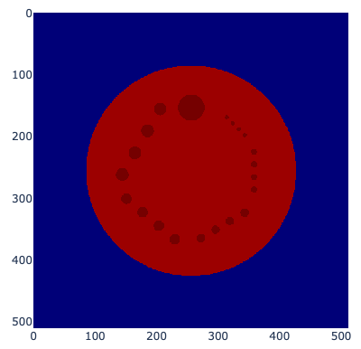

# About

This is a python library to generate numerical phantom of ACR (American College of Radiology)
CT phantom which is provied as Gamma 464 phantom.

You can use this numerical phantom for an image reconstruction lecture or research.

At this time, this library provides only the module 2.

# Getting Started

1. Download or clone this repository

```
$ git clone https://github.com/akchan/acr_phantom_ct
```

2. Install requirements

```
$ pip install -r requirements.txt
```

3. Try the code! An image like below will be shown.

```
$ python numerical_phantom.py
```



# License

Distributed under the MIT License. See LICENSE.txt for more information.

# Contact

Satoshi Funayama, [@akcharine](https://twitter.com/akcharine)
